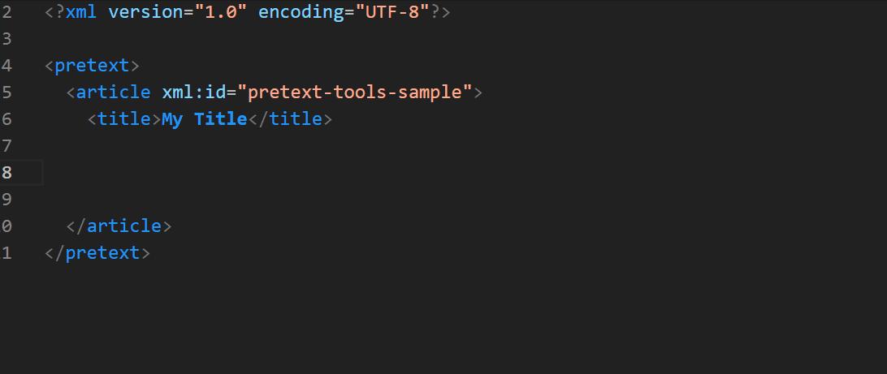

# PreTeXt-tools

A Visual Studio Code extension to make writing PreTeXt documents easier.

## Features

- Defines the PreTeXt language, automatically selecting it for `.ptx` files.
- Syntax highlighting and indentation based on XML, plus some additions like recognizing math as LaTeX.
- **Native schema validation** built into the extension's own language server — no third-party XML extension required. Get inline diagnostics with improved error messages, including duplicate-id and cross-reference checks.
- A large collection of snippets for most PreTeXt elements, plus smart completions based on the schema (tags, attributes, and cross-references).
- **Live Preview**: an in-editor, side-by-side preview rendered directly from the official PreTeXt stylesheets — no PreTeXt/Python installation required, and rebuilds take well under a second. Includes two-way sync: forward search jumps the preview to your cursor, and clicking in the preview jumps back to the source (inverse search).
- **Visual Editor** (experimental): a WYSIWYG, TipTap-based editor for PreTeXt documents, for authoring without touching raw XML.
- **Import Project wizard**: turn an existing LaTeX, Markdown, or Pandoc-supported document into a new PreTeXt project, with a preview of the converted structure before anything is written to disk.
- A **PreTeXt sidebar panel** with Actions (one-click build/view/generate/deploy/import/convert), Targets (build or view any target from `project.ptx` directly), and a Document Outline that follows `xi:include`.
- A front-end for the [PreTeXt-CLI](https://github.com/PreTeXtBook/pretext-cli), with commands available through a statusbar menu, keyboard shortcuts (Ctrl+Alt+P for command menu, Ctrl-Alt-B to build, Ctrl-Alt-V to view, etc.), and the command pallet (search for PreTeXt).
- Use pandoc to convert almost any file format to PreTeXt.
- Convert small passages of LaTeX to PreTeXt.
- A PreTeXt-aware formatter, with configurable blank-line style, sentence splitting, and line-wrap width.

## Usage

### Identifying PreTeXt Documents

Open the root folder of your PreTeXt project in VSCode. Open any of your source documents. If it has a `.ptx` file extension, it should be identified as a PreTeXt document, and you will see "PreTeXt" as the language in the bottom right corner of the window. You can associate other file extensions with the PreTeXt language using the "Files: Associations" setting (Ctrl+, brings up settings). Or you can select PreTeXt for a particular document using the "Change Language Mode" command.

Having a document identified as a PreTeXt document will give you:

- Syntax highlighting
- Access to snippets and completions of PreTeXt tags, attributes, and cross-references.
- Access to keyboard shortcuts for PreTeXt commands.
- Native schema validation, with diagnostics shown inline as you type.
- Better spell checking using the Code Spell Checker extension.

### Completions/Snippets

PreTeXt has a lot of markup to describe the structure of the document. To vastly speed up the authoring of the documents, the extension provides autocomplete _snippets_ for almost all of the supported tags and attributes of PreTeXt. As you type, if you start typing a tag, such as `<example>`, autocomplete will pop up a menu at your cursor suggesting this tag. If you hit ENTER (or if configured, TAB), then the snippet will expand and put your cursor in the right spot to start typing the statement of the example.

Some shorter snippets also allow you to tab out of them. For example, start typing `<m>` and hit enter. Your cursor will be between the start and end tags. When you are done typing your math, hit tab to jump out of the tags so you can keep typing.

Short tags like `<m>` and `<c>` and `<em>` can also be used to wrap selected content. Select the string of characters you want inside the tag, and start typing the tag name, then hit enter when given the option. The selected text should be restored with the start and end tags surrounding it.

Attributes are available if you start typing with "@".

If you open a new empty document that you will include via `xi:include`, save it with a `.ptx` extension and then fill in the structure using a "!" snippet.

Here are some options that I find make snippets more useful. For each of these, open settings in VS code and search for them.

- Emmet: Excluded Languages. I exclude PreTeXt Emmet for PreTeXt, since the snippets behave better.
- Editor: Snippets Suggestions. I set this to "bottom" so that the snippets are shown after other autocomplete suggestions.
- Editor: Tab Completion. I set this to "only snippets" so that I can hit TAB or ENTER to select the snippet.
- If you get too many snippet suggestions, experiment with the quick-suggest and completion settings. Please contribute suggestions on the best configuration if you find something that works well.

### Live Preview

Run `PreTeXt: View Live Preview` (or click the preview icon) to open a side-by-side preview of your document. It renders the official PreTeXt stylesheets directly in the extension — no PreTeXt or Python installation needed — and refreshes automatically as you edit. It stays in sync with your source in both directions:

- **Forward search**: `PreTeXt: Forward Search` (or just move your cursor) scrolls the preview to match where you are in the source.
- **Inverse search**: clicking a paragraph in the preview jumps your cursor to the matching line in the source.

Use the `PreTeXt: Live Preview: Choose Scope` command, or the `pretext-tools.instantPreview.scope` setting, to preview just the current file or the whole project.

There is also an older, CLI-based `PreTeXt: Live Preview via CLI build` command (experimental), which shells out to `pretext build` and requires PreTeXt to be installed — most users should prefer the built-in Live Preview above.

### Visual Editor (experimental)

`PreTeXt: Open file with Visual Editor` opens a WYSIWYG editor for the current document, built on TipTap/ProseMirror. It lets you author and edit PreTeXt content (divisions, theorem-like blocks, math, and more) without writing raw XML, while keeping the file's underlying markup intact.

### Sidebar Panel

The PreTeXt icon in the activity bar opens a dedicated panel with three views:

- **Actions** — one-click access to the most common commands: build, view, generate assets, deploy, new/import project, convert, and format.
- **Targets** — every target defined in your `project.ptx`, each with inline build (▶) and view (👁) buttons; click a target to jump to its definition in the manifest.
- **Document Outline** — a live outline of your document's structure (divisions, and optionally block-level elements like theorems and figures), following `xi:include` across files. Click any entry to jump to it in the source.

### Importing an Existing Project

`PreTeXt: Import Project from LaTeX/Markdown/PreTeXt` opens a wizard that turns an existing document (LaTeX, Markdown, or anything Pandoc can read) into a new PreTeXt project. It shows a preview of the converted structure and lets you choose between a converted or native PreTeXt layout before anything is written to disk.

### Running PreTeXt

To build and view projects, and to generate assets, the extension calls the PreTeXt-CLI. Of course, you can open a terminal in VS Code (CTRL+\`) and type `pretext build web`, but you can also get more visual feedback by using the PreTeXt button in the bottom status bar, the PreTeXt sidebar panel, the keyboard shortcut Ctrl+Alt+P, or through the command pallet (CTRL+SHIFT+P). Follow the menus to select the command you want to run.

In particular, if you are working with multiple projects in the same window, you might need to refresh your list of targets (this list is determined by looking at the `project.ptx` manifest, but is set once when a project is opened).

All this assumes you that have the PreTeXt-CLI installed. The extension will try to install this for you if not, but that still requires Python 3.8.5 or later, and PIP to be installed. If you don't have that yet, see the [PreTeXt documentation](https://pretextbook.org/doc/guide/html/quickstart-getting-pretext.html).

If you have PreTeXt-CLI installed in a virtual environment, or have a non-standard way of calling python, you can set the path to the python executable (of your virtual environment of system) in the "python Path" setting.

### Formatting

Using the command pallet, you can request to "Format Document With..." and select "pretext-tools" as the formatter. You can also set this as the default from that menu. In settings, you can specify to "Split Sentences" which will take long paragraphs and start new lines after each period, control how many blank lines are inserted between elements, and set a "Print Width" to wrap long lines at a given column (set to 0 to disable wrapping).

Consider setting "Format on Save" to keep your document nicely formatted always.

### Converting to PreTeXt

You can convert selected LaTeX to PreTeXt using the `PreTeXt: Convert LaTeX to PreTeXt` command from the command pallet. This will not work for all LaTeX, and is not guaranteed to produce valid PreTeXt, but it should get you close.

If you have pandoc installed, you can convert almost any format of document to PreTeXt using the `PreTeXt: Convert to PreTeXt` command from the command pallet.

To turn a whole existing document into a new PreTeXt project (rather than converting a snippet), use the `PreTeXt: Import Project from LaTeX/Markdown/PreTeXt` wizard described above.

## Change log

You can track the ongoing development progress in the [Changelog](CHANGELOG.md).

## Contributions

Like this extension? [Star it on GitHub](https://github.com/oscarlevin/pretext-tools/stargazers)!

Do you have an idea or suggestion? [Open a feature request](https://github.com/oscarlevin/pretext-tools/issues).

Found something wrong? [File an issue](https://github.com/oscarlevin/pretext-tools//issues).

Pull requests welcome.
